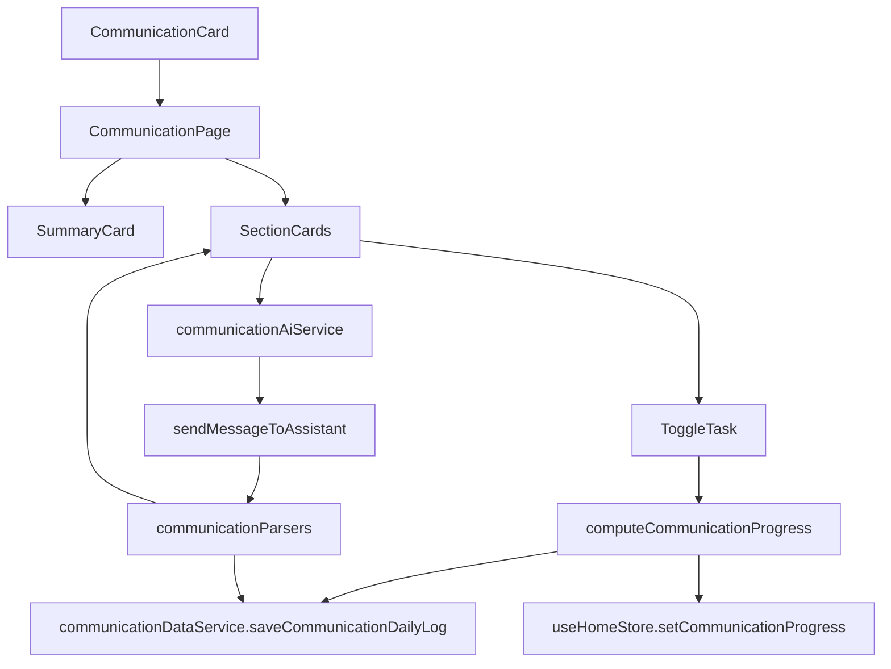

# Communication Feature Design

## Goal
Build `Communication` as a focused daily-practice feature that helps the user improve:

- English fluency
- speech clarity
- calm speaking
- thought structuring
- tonality
- grammar
- article presentation confidence
- mindful articulation

This feature must be independent from Chat and should reuse shared OpenAI transport and Firestore only where needed.

## Product Direction
Communication is not a single tool. It is a guided daily system made of repeatable exercises and AI-assisted practice.

Core principle:

- Language is a tool for communication, but fluency in English is the first foundation for mastering communication.

## Scope
Version 1 includes:

- a dedicated `CommunicationPage`
- weighted progress tracking
- daily checklist-based exercises
- AI-generated grammar tests
- AI-generated grammar exercises based on answers
- AI-generated practice for selected communication sections
- article reading and presentation workflow using notes and checkboxes
- Home card progress sync
- Firestore-backed daily persistence

Version 1 does not include:

- in-app camera recording
- speech-to-text scoring
- audio upload or transcription
- changes to Chat UI, Chat flow, or Chat state architecture

## User Journey
1. User opens `Home`.
2. User taps the `Communication` card.
3. User lands on `CommunicationPage`.
4. Top summary card shows weighted progress, completed sections, and completed tasks.
5. User works through section cards:
   - English Fluency
   - Tongue Twisters
   - Smooth and Calm Speaking
   - Thought Structuring
   - Tonality
   - Article Presentation
   - Grammar
   - Mindful Speaking
6. User checks off completed tasks.
7. AI actions generate drills, grammar tests, grammar exercises, and reflection prompts.
8. Progress recalculates immediately.
9. The day log is saved in Firestore.
10. Home shows the updated Communication progress.

## UX Structure
The page follows the same top visual style as `NutritionPage`.

Top area:

- floating back button
- Communication summary card
- weighted progress bar
- section/task counts
- refresh action

Main body:

- one card per communication section
- each card contains:
  - short explanation
  - checklist items
  - optional AI action
  - optional AI result card
  - section progress

Article Presentation card also contains:

- source selector for `Economic Times` and `Indian Express`
- article title input
- article url input
- notes textarea
- self-review textarea

Grammar card also contains:

- generate grammar test action
- grammar test dialog
- answer submission flow
- personalized grammar exercises result
- weak areas and recommendations

## Weighted Progress Model
Sections and weights:

- `englishFluency`: 13
- `tongueTwisters`: 10
- `smoothCalmSpeaking`: 10
- `speechClarityDrill`: 10
- `thoughtStructuring`: 13
- `tonality`: 10
- `articlePresentation`: 13
- `grammar`: 13
- `mindfulSpeaking`: 8

Rules:

- each section has required tasks
- section progress = completed tasks / total tasks
- a section contributes its full weight only when all required tasks are done
- overall progress = sum of completed section weights
- Home progress is clamped to `1-100`
- page section progress remains `0-100`

This mirrors the Nutrition feature idea of a top-level progress summary while fitting checklist-based learning instead of nutrient math.

## Default Daily Sections
### English Fluency
- Speak only in English for one focused practice round
- Describe your day or routine in English

### Tongue Twisters
- Generate a tongue twister set with AI
- Practice the tongue twisters slowly and clearly

### Smooth and Calm Speaking
- Do one breathing exercise before speaking
- Speak one topic slowly with deliberate pauses

### Speech Clarity Drill
- Place a pen or pencil horizontally between your teeth and speak clearly
- Read an article aloud while doing the pencil drill
- Say tongue twisters while doing the pencil drill

### Thought Structuring
- Generate a thought-structuring prompt with AI
- Present one response using main point, support, and conclusion

### Tonality
- Practice emphasizing important words naturally
- Review whether the tone felt calm, clear, and confident

### Article Presentation
- Read one article from Economic Times or Indian Express
- Write short key points or notes
- Present the article in front of the camera
- Self-review clarity, structure, and tone

### Grammar
- Generate a grammar test with AI
- Answer the grammar test
- Review and practice generated grammar exercises

### Mindful Speaking
- Do one articulation drill
- Pause before speaking and state the thought clearly

## Technical Architecture
Feature folder:

- `src/features/Communication/CommunicationPage.tsx`
- `src/features/Communication/components/`
- `src/features/Communication/hooks/`
- `src/features/Communication/services/`
- `src/features/Communication/utils/`
- `src/features/Communication/types/`
- `src/features/Communication/constants/`

Responsibilities:

- `CommunicationPage.tsx`
  - page composition
  - wires summary, section cards, article card, grammar dialog
- `components/`
  - presentational UI only
- `hooks/useCommunicationData.ts`
  - load current daily log
  - save progress changes
  - update article data
  - persist AI results
- `hooks/useCommunicationProgress.ts`
  - compute progress snapshot
  - sync Home progress
- `hooks/useCommunicationAiActions.ts`
  - orchestrate grammar and section AI actions
- `services/communicationDataService.ts`
  - Firestore read/write
- `services/communicationAiService.ts`
  - wraps shared OpenAI transport
- `utils/communicationProgress.ts`
  - pure weighted progress logic
- `utils/communicationDefaults.ts`
  - default sections and daily log creation
- `utils/communicationPrompts.ts`
  - feature-local AI prompts
- `utils/communicationParsers.ts`
  - feature-local AI response parsing

## Firestore Design
Dedicated collection:

- `communication_daily_logs/{userId_date}`

Stored fields:

- `user_id`
- `log_date`
- `overall_progress`
- `completed_task_count`
- `total_task_count`
- `completed_section_count`
- `total_section_count`
- `section_progress`
- `sections`
- `article_practice`
- `grammar_test_summary`
- `ai_generated_exercises`
- `created_at`
- `updated_at`

Why a separate collection:

- keeps Communication independent from Nutrition
- avoids overloading `daily-log`
- allows future communication analytics
- preserves Chat feature boundaries

## AI Integration
Shared transport reused:

- `src/features/Chat/chatservice.ts`

Important rule:

- reuse transport only
- do not reuse Chat page logic, streaming controller, or chat state

Communication AI service supports:

- grammar test generation
- grammar exercise generation based on answers
- tongue twister practice generation
- thought-structuring prompt generation
- section practice generation
- article reflection question generation

All Communication prompts and parsers stay inside the Communication feature.

## Grammar Flow
1. User taps `Generate test`.
2. AI returns structured grammar questions.
3. Questions open in a dialog.
4. User writes answers.
5. User taps `Generate grammar exercises`.
6. AI analyzes answers and returns:
   - weaknesses
   - recommendations
   - exercises
7. Result is stored in Firestore and shown in the Grammar card.
8. User marks final grammar practice task complete after doing the exercises.

## Article Presentation Flow
1. User selects source:
   - Economic Times
   - Indian Express
2. User enters article title and optional url.
3. User writes short notes.
4. User presents the article in front of the camera outside the app.
5. User writes self-review notes.
6. User can ask AI for reflection questions.
7. User marks checklist items complete.

Version 1 keeps article presentation practical and lightweight without building recording infrastructure.

## Home Progress Integration
Home store includes Communication progress.

Flow:

- `CommunicationPage` computes weighted progress
- progress is synced into `useHomeStore`
- `HomePage` also fetches today’s Communication log from Firestore
- Home card shows real Communication progress even after reload

This makes the Communication card behave like a real tracked feature, not a static menu item.

## Data Flow

## Error Handling
- Firestore load failure:
  - show local default state
  - show error banner
- Firestore save failure:
  - keep optimistic UI
  - surface save error
- AI invalid response:
  - do not save malformed result
  - show feature-local error
- empty grammar test result:
  - block dialog submit path

## Testing Strategy
Most business logic is extracted so it can be tested without rendering full UI.

Priority test targets:

- `computeCommunicationProgress()`
- default section builder
- grammar test parser
- grammar exercise parser
- Firestore mapping in `communicationDataService`
- AI action success/error handling in hooks

UI tests can cover:

- top summary progress rendering
- toggling tasks updates section progress
- grammar dialog open/submit flow
- article source and notes persistence behavior

## Rollout Plan
### Phase 1
- types
- constants
- defaults
- progress utilities
- Firestore data service

### Phase 2
- summary card
- section cards
- article practice UI
- Home progress sync

### Phase 3
- grammar test AI flow
- grammar exercise AI flow
- section practice generators

### Phase 4
- polish
- better copy
- empty states
- tests

## Constraints
- must not change existing Chat behavior
- must not move Communication state into Chat
- must not overload nutrition `daily-log`
- keep progress computation pure and testable
- avoid recording or analytics overbuild in v1

## Original Prompt (Keep As Shared)
english or language is tool which canbbe used for better communication, but first we will need to be fluent in english to master communucation.

tongue twisters for speech clarity english

daily exercises for smooth and calm speaking

exercisese to structure thoughts (present thoughts) or structreu the what you want to say

tonality, the way you speak

ecomnomic tmes inidan express read article and ( wrute first optional)present it in front of camera.

grammar exercises

mindful speaking exerciese for crystal clear what you are about to say ( articulaion better exercises)

ask ai for grammer test and take that grammer test basis on that ask ai to design grammar exercises, Should not change chat
# Communication Feature Design

## Goal

Build a Communication feature that improves clarity, fluency, confidence, vocabulary, and structured expression for daily speaking.

## Core Principle

Language tools can assist communication, but fluency in English is the first foundation for mastering communication.

---

# Feature Pillars

## 1. English Fluency Foundation

Daily fluency practice to reduce pauses, hesitation, and translation thinking.

Focus areas:

- Sentence flow
- Natural speaking rhythm
- Confidence in expression
- Thinking directly in English

Exercises:

- Short speaking drills
- Topic-based speaking practice
- Describe daily activities in English

---

## 2. Vocabulary Building

Build a stronger vocabulary to express ideas clearly and naturally.

Practice:

- Learn **5–10 new words daily**
- Use each word in **2–3 sentences**
- Learn synonyms and contextual usage

Focus areas:

- Everyday vocabulary
- Professional vocabulary
- Descriptive language

Example:

Word: **Implement**

Sentence:

> I implemented a new feature for the authentication module.

---

## 3. Grammar Exercises

Strengthen grammar to improve sentence accuracy and clarity.

Daily activities:

- Sentence correction
- Error spotting
- Tense practice
- Sentence transformation exercises

Focus areas:

- Common grammar mistakes
- Professional sentence formation
- Clarity in written and spoken communication

---

## 4. Tongue Twisters for Speech Clarity

Improve pronunciation and mouth clarity.

Practice:

- Daily tongue-twister drills
- Start slowly
- Gradually increase speed while maintaining pronunciation accuracy

Goal:

- Improve articulation
- Strengthen speech muscle control

---

## 5. Mindful Speaking & Articulation

Practice controlled and clear speech.

Exercises include:

- Articulation drills
- Conscious pronunciation
- Speaking with intention before delivering sentences

Focus areas:

- Speech clarity
- Pronunciation precision
- Deliberate communication

---

## 6. Smooth and Calm Speaking

Develop a relaxed and confident speaking style.

Exercises include:

- Breath control
- Slower speaking pace
- Pause discipline

Goal:

- Reduce rushed speech
- Maintain calm delivery
- Improve speaking confidence

---

## 7. Thought Structuring Exercises

Train the brain to organize ideas before speaking.

Framework:

**Main Point → Supporting Points → Conclusion**

Structure:

1. What is the main idea?
2. What are 2–3 supporting points?
3. Provide a short conclusion.

Goal:

- Reduce rambling
- Improve clarity
- Speak in structured responses

---

## 8. Tonality and Voice Delivery

Improve how ideas are delivered.

Focus areas:

- Pitch
- Pace
- Emphasis
- Vocal energy

Exercises:

- Record-and-review speaking sessions
- Practice emphasizing important words
- Control speaking speed

---

## 9. Article Reading and Camera Presentation

Combine reading, comprehension, and speaking practice.

Daily activity:

- Read one article from:
  - Economic Times
  - Indian Express
- Optionally write short summary notes
- Present key points in front of a camera

Goal:

- Improve articulation
- Improve structured speaking
- Build confidence while speaking on camera

---

## 10. Real Conversation Practice

Practice communication in real-world conversational scenarios.

Exercises:

- Simulate real conversations
- Practice answering questions
- Discuss everyday topics
- Explain ideas conversationally

Examples:

- Explain a project
- Describe a problem and solution
- Share an opinion on a topic

Goal:

- Develop spontaneous speaking ability
- Improve conversational confidence

---

## 11. Professional Communication (Workplace English)

Improve communication in professional environments.

Practice scenarios:

- Explaining technical concepts
- Giving project updates
- Discussing solutions
- Asking questions in meetings

Example practice sentences:

> I investigated the issue and found the root cause.

> I suggest we refactor this component for better maintainability.

> Let me walk you through the implementation.

Goal:

- Improve workplace communication
- Increase clarity in technical discussions
- Build confidence in meetings

---

## 12. AI-Assisted Grammar Learning Flow

Adaptive grammar improvement using AI.

Process:

1. Ask AI for a grammar test.
2. Take the test.
3. AI analyzes performance.
4. AI generates exercises based on weak areas.
5. Repeat improvement cycles.

Goal:

- Targeted grammar improvement
- Adaptive learning

---

## 13. Feedback and Progress Tracking

Track communication improvement over time.

Metrics:

- Speaking duration per day
- Vocabulary learned
- Grammar accuracy
- Speech clarity
- Pause frequency

Tools:

- Speaking recordings
- Performance summaries
- Improvement insights

Goal:

- Provide measurable progress
- Motivate consistent practice
- Identify weak areas

---

# Constraints

- This feature **must not change existing Chat behavior or Chat architecture**.
- The Communication feature should be built as an **independent module/page**.
- It can use existing AI capabilities without altering Chat flows.

---

# Suggested Daily Routine (Simple Version)

10 min — Tongue twisters and articulation practice  
10 min — Vocabulary building  
10 min — Grammar exercises  
10 min — Thought structuring speaking drill  
10 min — Read Economic Times / Indian Express article  
5–10 min — Camera presentation with tone focus  
5 min — Real conversation simulation

Total: **50–60 minutes per day**

## Original Prompt (Keep As Shared)
